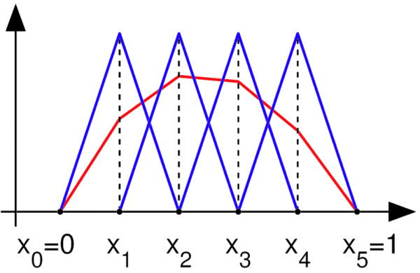

I got by with writing terrible code for a long time. Only when you either need to read your code much later or when you are dealing with massive amounts of calculations do you realise the value of good coding. With accessible languages like Python and Matlab or Octave you can do powerful things without knowing much more than `for` loops and a little googling.

To demonstrate the benefits of learning a little CS terminology I wanted to show a small example where using objects can really clean up your code. Integrating a 1D function should give a clear idea of how this would work. It is common when you start learning the to solve differential equations to use the following basis functions.

They look simple but how would you represent this in code? One idea is to code it directly for the problem you are trying to solve. The downside to that is first and foremost that it makes it hard to read the code and even worse to use it again if you need to change the problem for any reason. This is when it is good to be comfortable with objects, the core of object oriented programming. Python offers this paradigm and that is what I have used here. Since the interpolation functions are all the same, only shifted, you can call each element an object and just specify the attributes which here would be x_n and x_n+1.



class element:
    def __init__(self,x0,x1,LtoG):
        self.x0 = x0
        self.x1 = x1
        self.LtoG = LtoG
        self.dx = x1-x0



LtoG representing the mapping of the element to the grid. The basis is represented along with its derivative



def basis(self,x):
    if x < self.x0 or x > self.x1:
        return [0.0, 0.0]
    return [ (self.x1-x)/self.dx, (x-self.x0)/self.dx ]

def dbasis(self,x):
    if x < self.x0 or x > self.x1:
        return [0.0, 0.0]
    return [ -1.0/self.dx, 1.0/self.dx ]


You could obviously take higher derivatives if you want but generally when you learn this you will be using weak forms where the highest derivative will be the first one.

This makes the solution much more general. You could even take it as far as making the interpolation functions an attribute to the objects. I will not show that here. You can email me if you want a discussion about that. To close, this is what you will do to setup the using of this class.



E = []
for e in range(n-1):
 E.append( element(e*dx,(e+1)*dx,[e,e+1]) )


Or as a one-liner



E = [element(e*dx,(e+1)*dx,[e,e+1]) for e in range(n-1)]



This makes it such that all you need to specify is what is specific to your problem, the equation you are solving and the boundary conditions.

