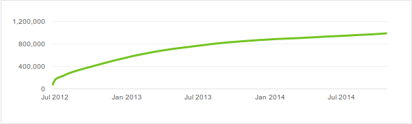
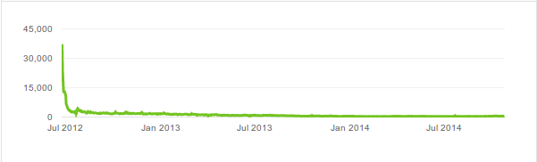

There are merits to being the most viewed. Fans and battlers debate these things back and forth. Youtube gives you a number for how often a video has been viewed and [VerseTracker](http://www.versetracker.com) gathers stats about individual battlers. There are the most viewed battlers and also those with the most average views. This undoubtedly can benefit leagues when setting up matches but my question is, could you predict the views?

If you look below the videos and choose more, you can usually look at statistics. A typical curve for the accumulated views looks like this

and the daily ones look something like this

These are curves I took today from the KOTD battle DNA vs Eurgh, I could have picked almost any.

This applies to almost all battles. They get a lot of views in the first days and then almost get exactly the same views per day ever after. If you could predict this curve you could predict what Youtube money that would get and therefore put a better price on the battle.

The first step towards that would be to note that this is a logarithmic curve. It grows fast in the beginning but then the growth slows down to something steady. It could be expressed as a function

t stands for time, and the B(beta) is a number you would need to find out. It would depend on the battlers, the leagues or anything you might think to be relevant.

This formula for the fitting is good because it is easy to find the beta for battles that have happened already you need to solve a very simple equation. You might want to do this to help with your predictions for those battles that haven't happened.

