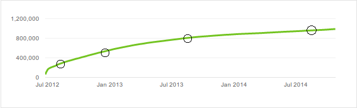

Where we left the story in the last post was that we need to find a number called beta. There are methods I will discuss later that you could use to predict those numbers for new battles, based on the ones from old battles. The question now is, how do we find the old ones?

There is a very simple equation for that I said last time. To make use of that we would need a few points from a curve, four might even suffice

You can use a method called [the method of least squares](http://en.wikipedia.org/wiki/Least_squares) to find out the beta.

Let's say we have these four points. They consist of a time t and a viewcount v. The system that needs to be solved for beta is the following

Which actually reduces to 

\beta=\frac{\sum_{i=1}^{4}v_i\ln(t_i)}{\sum_{i=1}^{4}\ln^2(t_i)}

if I'm not mistaken. So with the youtube data you could get fitting for these view curves which moves us closer to the goal.

As for now, Youtube provides no good way of getting this data so there is little one can do but speculate. Next post I will expand on this topic and talk about how you can refine your model through some more interesting math.