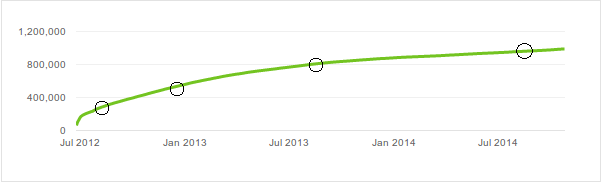

Where the story stands now is that we could make an equation for the curve of views if Youtube made the statistics accessible. With that we could somehow try to predict what future match ups would bring in terms of views. Before I get into that I want to note two things.

Putting a number to two names doesn't seem to be sufficient. This is evident by a battle like Hitman Holla vs. Conceited. Standing at about 1.5 million views, it is still below what you might have expected beforehand. It being a pretty bad battle must have some effect there.

Another thing to note is that good performances don't necessarily bring millions of views either. Illmaculate vs. Bigg K is somewhere above 3k despite all the hype around it when it came out probably peaking at many people and outlets naming it the battle of the year.

This number is not so surprising though if you look at other battles from these four that I mentioned. This is Bigg K's most viewed battle outside of Smack and has well over the views of an average Illmac battle (VerseTracker has him at a little over 1k).

A simple model for this can be constructed with the methods of game theory. The options would look something like this

Both do good, one of them does good or both do badly. From this the idea is that there are four possible outcomes which would lead to four possible beta's to predict this curve.

Where we left the story in the last post was that we need to find a number called beta. There are methods I will discuss later that you could use to predict those numbers for new battles, based on the ones from old battles. The question now is, how do we find the old ones?

There is a very simple equation for that I said last time. To make use of that we would need a few points from a curve, four might even suffice

You can use a method called [the method of least squares](http://en.wikipedia.org/wiki/Least_squares) to find out the beta.

Let's say we have these four points. They consist of a time t and a viewcount v. The system that needs to be solved for beta is the following

Which actually reduces to 

if I'm not mistaken. So with the youtube data you could get fitting for these view curves which moves us closer to the goal.

As for now, Youtube provides no good way of getting this data so there is little one can do but speculate. Next post I will expand on this topic and talk about how you can refine your model through some more interesting math.